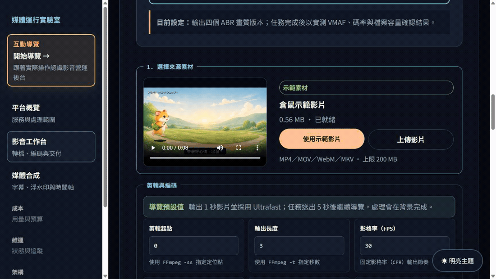
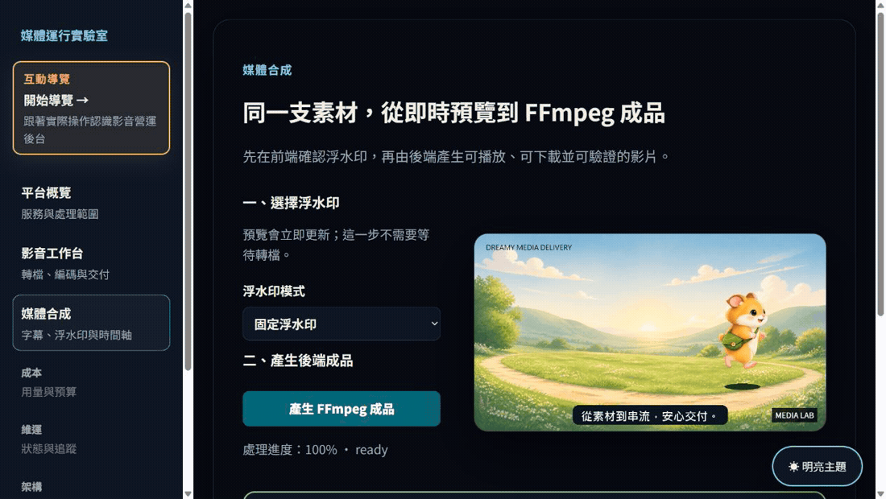
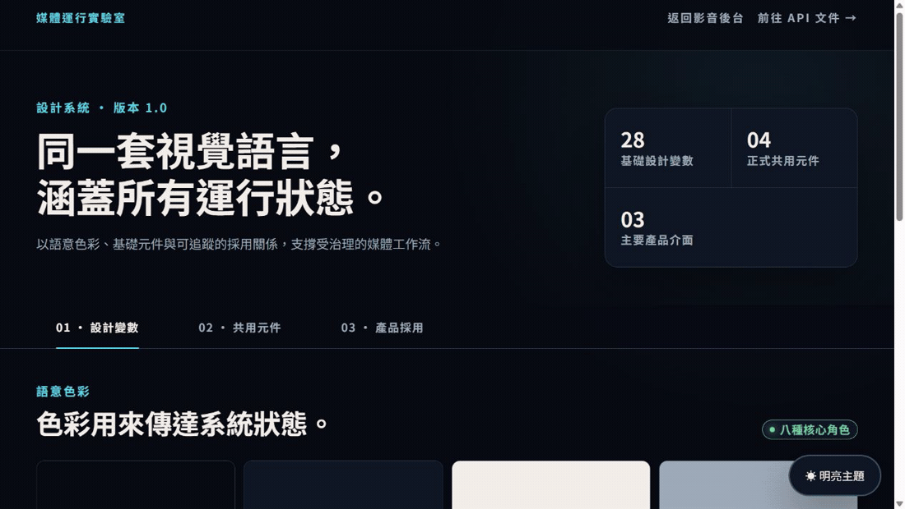
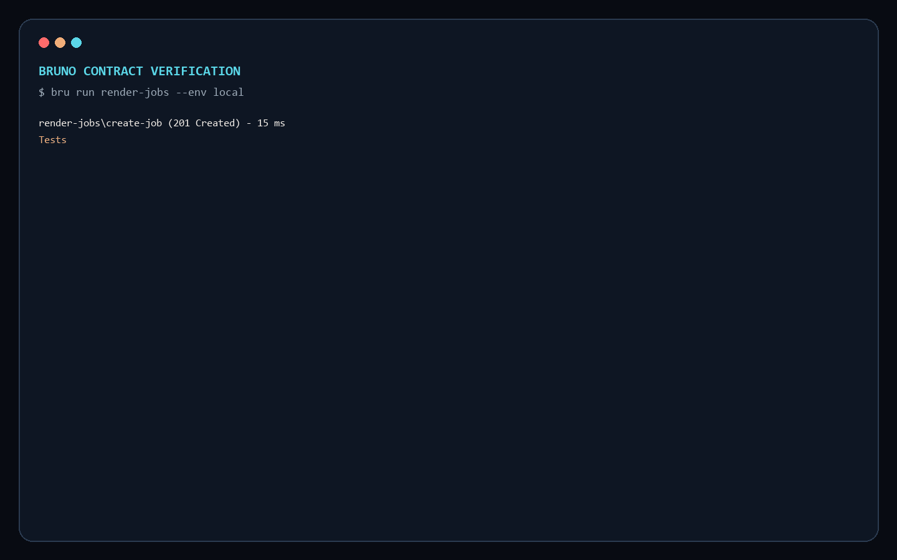

# Media Runtime Lab

[](https://github.com/RemyJerrie1/media-runtime-lab/actions/workflows/verify.yml)

**影音處理與串流交付營運後台。** 使用 Next.js、NestJS、PostgreSQL 與 FFmpeg，串起素材上傳、轉檔、浮水印合成、任務追蹤與成品播放。

前端送出處理參數，後端實際產生 MP4 與 HLS 檔案；任務、進度事件與交付紀錄保存在資料庫，切換頁面後仍可查詢結果。

## 產品展示

### 影音平台｜從倉鼠素材到串流成品

選擇倉鼠示範影片、設定編碼參數、送出轉檔，再切換輸出畫質預覽。後端產生四個畫質版本、HLS 播放清單與 CMAF 分段。展示等待時間經過剪輯；點擊動圖可開啟清晰版 MP4。

<a href="./docs/media/render-workflow-dark.mp4"></a>

### 媒體合成｜浮水印預覽與實際成品

在播放中的倉鼠影片上切換無浮水印、固定浮水印與動態時間浮水印，確認預覽後送出合成任務，播放 FFmpeg 產生的成品。

<a href="./docs/media/composition-workflow-dark.mp4"></a>

### 設計系統

實際上下捲動深色頁面，切換「設計變數、共用元件、產品採用」，查看色彩、字體、間距，以及按鈕、狀態徽章、指標卡和進度列。

<a href="./docs/media/design-system-scroll-dark.mp4"></a>

### Bruno API 回歸測試

以 CLI 驗證任務建立、狀態查詢、冪等重送與錯誤請求。以下保留早期版本的深色終端機測試回放；目前請求與斷言以 [Bruno collection](./bruno) 為準。

<a href="./docs/media/bruno-terminal-dark.mp4"></a>

## 主要功能

- 來源素材：使用內建示範影片或上傳 MP4、MOV、WebM、MKV。
- 轉檔設定：剪輯區間、CRF、Preset、GOP、幀率與音畫同步。
- 畫質預估：送出前顯示 1080p 碼率、VMAF 等級與每小時容量。
- 串流交付：產生 360p、540p、720p、1080p 四個版本，以及 HLS Master Playlist 與 CMAF 分段。
- 媒體合成：字幕、可視浮水印、動態浮水印與時間軸預覽。
- 任務追蹤：顯示處理狀態、進度、播放檢查、Request ID 與成品雜湊。
- 用量管理：呈現用量、成本歸因與預算門檻。
- API 文件：Web 參考頁與 Bruno collection 使用相同端點分類。

## 技術架構

| 工程問題 | 實作方式 | 驗證入口 |
| --- | --- | --- |
| 耗時轉檔阻塞操作 | HTTP 建立任務、Worker 處理、SSE 回傳進度 | [任務調度](./apps/api/src/render/application/render-orchestrator.ts) |
| 重送與中斷造成工作遺失 | 租戶範圍冪等識別、持久化事件、有期限的工作租約 | [PostgreSQL 整合測試](./apps/api/src/render/infrastructure/postgres-workflow.integration.test.ts) |
| 前後端與文件不同步 | Zod 共用契約、API 文件與 Bruno 合約檢查 | [契約檢查](./scripts/check-contract-drift.mjs) |
| 無法確認交付檔案 | FFmpeg、ffprobe、SHA-256 與播放清單 | [媒體處理器](./apps/api/src/render/infrastructure/ffmpeg-media-processor.ts) |
| 主題與元件不一致 | 共用設計變數、語意元件及明暗對比檢查 | [色彩檢查](./scripts/check-a11y-colors.mjs) |

後端依 interfaces、application、domain 與 infrastructure 分層；應用層依賴儲存介面，由 PostgreSQL adapter 實作。本機規模使用 PostgreSQL 協調工作，減少獨立佇列的部署成本；工作負載需要獨立擴縮時，可沿用介面替換調度實作。

```text
Next.js 操作介面
        │
        ▼
NestJS API ── PostgreSQL 任務與事件
        │
        ▼
FFmpeg / ffprobe ── MP4、HLS、CMAF、VMAF、SHA-256
```

```text
apps/web/                 Next.js 操作介面與導覽
apps/api/src/render/
  domain/                 任務狀態與媒體規則
  application/            任務調度與 Worker
  interfaces/             HTTP 與 SSE
  infrastructure/         PostgreSQL、檔案與 FFmpeg
packages/contracts/       前後端共用 Zod schema
bruno/                    API 回歸測試
```

## 本機執行與服務管理

需要 Node.js 22、pnpm 11.16.0、Docker Desktop（Linux containers）與 PowerShell。首次執行：

```powershell
git clone https://github.com/RemyJerrie1/media-runtime-lab.git
cd media-runtime-lab
git switch dev
corepack enable
pnpm install --frozen-lockfile
pnpm demo
```

若已另行設定本機 `media-lab` 便利指令，可在任意 PowerShell 工作目錄管理服務。新 clone 使用上面的 pnpm 指令即可：

```powershell
media-lab start
```

| 指令                | 說明                                                  |
| ------------------- | ----------------------------------------------------- |
| `media-lab start`   | 啟動 PostgreSQL、API 與 Web，通過健康檢查後開啟瀏覽器 |
| `media-lab status`  | 檢查 3000、4000 與 5432 連接埠的服務狀態              |
| `media-lab restart` | 停止本專案服務後重新啟動                              |
| `media-lab stop`    | 停止 Web、API 與本專案 PostgreSQL                     |

在專案根目錄可使用對應的 pnpm scripts：

```powershell
pnpm demo
pnpm demo:restart
pnpm demo:stop
```

啟動器會準備 `.env`、檢查套件與 PostgreSQL，啟動 API 與 Web，健康檢查通過後開啟瀏覽器。紀錄位於 `.demo-logs`。啟動器會重啟占用 3000／4000 的程序，請保留這兩個連接埠供本專案使用。

從「開始導覽」進入操作流程。導覽使用一秒影片與 Ultrafast 預設值，送出約五秒後繼續介紹其他功能；這是導覽停留時間，並非轉檔完成時間保證。完成後回到工作台播放成品。

- Web：<http://localhost:3000/overview>
- API：<http://localhost:4000>
- API 文件：<http://localhost:3000/api-reference>

## API

| 分類     | 端點                              | 用途                |
| -------- | --------------------------------- | ------------------- |
| 媒體資產 | `POST /v1/media`                  | 上傳來源影片        |
| 媒體資產 | `POST /v1/media/demo`             | 準備內建示範素材    |
| 媒體資產 | `GET /media/:assetId`             | 預覽來源影片        |
| 轉檔任務 | `POST /v1/render-jobs`            | 建立處理任務        |
| 轉檔任務 | `GET /v1/render-jobs/:id`         | 查詢任務狀態        |
| 轉檔任務 | `GET /v1/render-jobs/:id/events`  | 接收 SSE 進度事件   |
| 串流交付 | `GET /artifacts/:jobId.mp4`       | 播放或下載 MP4      |
| 串流交付 | `GET /streams/:jobId/master.m3u8` | 取得 HLS 主播放清單 |
| 維運     | `GET /v1/operations`              | 查詢任務與用量摘要  |

在 Bruno 開啟 `bruno/`，選擇 `local` 環境，依序執行「準備示範素材」與「建立算圖任務」。回應腳本保存 `assetId` 與 `jobId`，供後續請求使用。CLI 入口執行 `render-jobs` 資料夾：

```powershell
pnpm bruno
```

## 品質檢查

```powershell
pnpm verify
```

檢查格式、架構邊界、API／Bruno 契約、明暗色彩對比、TypeScript、測試與正式建置。PostgreSQL 整合測試需要 `DATABASE_URL`；未設定會略過。GitHub Actions 提供 PostgreSQL 測試服務，並額外檢查高風險套件漏洞。

## 實作範圍與限制

- 媒體處理、任務持久化、事件接續、工作租約與檔案交付在本機實作；外部 AI 供應商、物件儲存／CDN、正式身分認證與分散式監控尚未整合。
- 送出前的品質與容量是估算；VMAF 實測需要 `libvmaf`。不支援時回報無法量測，不能把估算當成實測。
- 色彩測試涵蓋指定的明暗設計變數組合，不等同整站 WCAG 認證。維運文件中的服務目標是設計目標，並非生產環境 SLA。

延伸文件：

- [模組化控制平面](./docs/adr/0001-modular-control-plane.md)
- [任務持久化與事件接續](./docs/adr/0002-durable-workflow-and-replay.md)
- [維運與失敗模式](./docs/architecture/operations.md)
