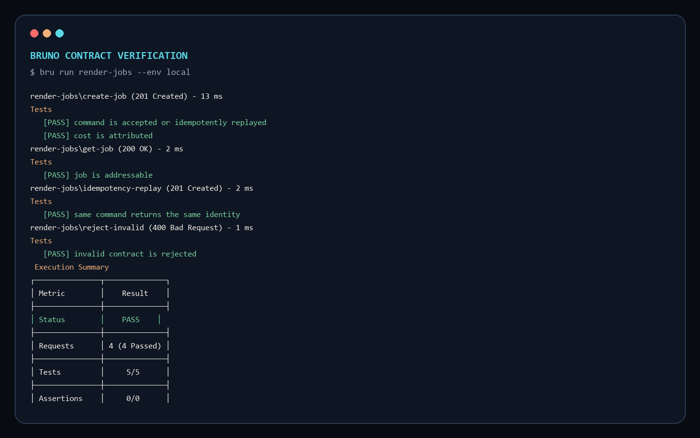

# Media Runtime Lab

> A governed full-stack media runtime by Chloe · Senior Full-Stack Media Engineer

我把影音產品最容易被拆散的三條責任鏈放進同一個可執行系統：內容如何進入算圖管線、任務如何可靠地完成，以及每次 AI／媒體運算如何留下成本與成品憑證。


## 30 秒看懂作品

[](./docs/media/product-demo.mp4)

一次操作走完 `Create Command → NestJS State Machine → SSE Progress → Artifact Receipt → Token / Cost Attribution`。上方動畫可直接預覽；點擊可開啟 MP4。

這不是大量功能的拼裝，而是一條刻意縮小、仍保留完整工程語意的媒體路徑：

- **Experience Plane** — Next.js／TypeScript 將後端契約、即時進度與成本回饋做成可驗收的操作面。
- **Control Plane** — NestJS 負責 Zod contract、idempotency、合法狀態遷移與一致錯誤語意。
- **Execution Port** — Canvas／FFmpeg 提供可重現的媒體輸出；AI provider 是可替換能力，不是不可控的核心相依。
- **Evidence Plane** — 每個 Job 都回報 Artifact、Token、預估成本及權威狀態。

## API 是可執行的契約



[](./docs/media/bruno-contract-tests.mp4)

Bruno collection 從程序外驗證四個情境，而不是只測 controller 內部實作：

1. 建立算圖任務並取得成本憑證。
2. 以 Job ID 讀回權威狀態。
3. 重送相同 Idempotency Key，確認回到同一個 Job Identity。
4. 拒絕超出邊界的媒體命令，維持一致錯誤契約。

靜態 API Reference 位於 `apps/web/app/api-reference`；Zod schema、NestJS controller、Bruno fixture 與文件由 contract drift gate 一起檢查。

## 我如何治理 AI 產碼

AI 可以提出變更，但 repository policy 決定它能否進入系統：

- `AGENTS.md` 定義依賴方向、契約變更順序與完成條件。
- `.claude/skills/safe-media-change` 規範媒體管線變更必須保留 deterministic fallback、成本歸戶及回歸證據。
- `.claude/hooks/protect-contracts.mjs` 阻止只改 schema、沒有同步 Bruno／API Reference／tests 的變更。
- `check-boundaries.mjs` 是 Architecture Fitness Function，拒絕 domain 反向依賴 framework 或 infrastructure。
- `check-contract-drift.mjs` 防止公開契約、文件與可執行案例分叉。
- Domain tests 同時鎖定合法與非法狀態遷移；Bruno 再從 HTTP 邊界做回歸。

## 架構演進不是預先堆疊

目前以 in-memory repository 清楚呈現 domain／application／interface／infrastructure 邊界，並明確標記它不是 production persistence。下一個投資 Gate 才會加入 Prisma／PostgreSQL 與 Outbox；當 queue wait、worker isolation 或持續流量達到門檻後，再把 execution port 移往 BullMQ／SQS 與 ECS／EKS／Cloud Run。

決策理由與重新評估條件記錄於 [`ADR 0001`](./docs/adr/0001-modular-control-plane.md)。

<details>
<summary><strong>工程師驗證方式</strong></summary>

Windows 可直接雙擊根目錄的 `START_DEMO.cmd`；它會啟動 Web／API，通過健康檢查後自動開啟瀏覽器。

```bash
pnpm install
pnpm verify
pnpm dev
```

- Web: `http://localhost:3000`
- API: `http://localhost:4000`
- API Reference: `http://localhost:3000/api-reference`
- Bruno: `pnpm bruno`

`pnpm verify` 會依序執行 architecture gate、contract drift、TypeScript、unit／contract tests 與 production build。

</details>
