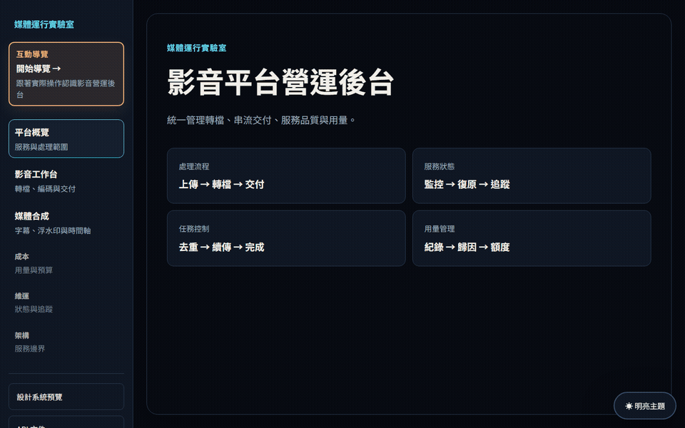

# Media Runtime Lab

[](https://github.com/RemyJerrie1/media-runtime-lab/actions/workflows/verify.yml)

影音平台營運後台，涵蓋來源素材、FFmpeg 轉檔、ABR 串流、字幕與浮水印、任務追蹤及用量管理。

## 產品展示

從「開始導覽」進入完整操作流程。導覽採用一秒影片與 Ultrafast 預設值，送出任務約五秒後會繼續介紹其他功能；轉檔仍在後端執行，完成後可回到影音工作台預覽成品。

<a href="./docs/media/product-demo-dark.mp4"></a>

## 主要功能

- 來源素材：使用內建示範影片或上傳 MP4、MOV、WebM、MKV。
- 轉檔設定：剪輯區間、CRF、Preset、GOP、幀率與音畫同步。
- 畫質預估：送出前顯示 1080p 碼率、VMAF 等級與每小時容量。
- 串流交付：產生 360p、540p、720p、1080p 四個版本，以及 HLS Master Playlist 與 CMAF 分段。
- 媒體合成：字幕、可視浮水印、動態浮水印與時間軸預覽。
- 任務追蹤：顯示處理狀態、進度、播放檢查、Request ID 與成品雜湊。
- 用量管理：呈現用量、成本歸因與預算門檻。
- API 文件：Web 參考頁與 Bruno collection 使用相同端點分類。

## 技術架構

```text
Next.js 操作介面
        │
        ▼
NestJS API ── PostgreSQL 任務與事件
        │
        ▼
FFmpeg / ffprobe ── MP4、HLS、CMAF、VMAF、SHA-256
```

```text
apps/web/                 Next.js 操作介面與導覽
apps/api/src/render/
  domain/                 任務狀態與媒體規則
  application/            任務調度與 Worker
  interfaces/             HTTP 與 SSE
  infrastructure/         PostgreSQL、檔案與 FFmpeg
packages/contracts/       前後端共用 Zod schema
bruno/                    API 回歸測試
```

## 本機啟動

Windows 開機後，在任意 PowerShell 視窗執行：

```powershell
media-lab start
```

常用指令：

```powershell
media-lab status
media-lab restart
media-lab stop
```

也可在專案根目錄執行：

```powershell
pnpm demo
pnpm demo:restart
pnpm demo:stop
```

啟動器會準備 `.env`、檢查套件與 PostgreSQL，啟動 API 與 Web，健康檢查通過後開啟瀏覽器。紀錄位於 `.demo-logs`。

- Web：<http://localhost:3000/overview>
- API：<http://localhost:4000>
- API 文件：<http://localhost:3000/api-reference>

## API

| 分類 | 端點 | 用途 |
| --- | --- | --- |
| 媒體資產 | `POST /v1/media` | 上傳來源影片 |
| 媒體資產 | `POST /v1/media/demo` | 準備內建示範素材 |
| 媒體資產 | `GET /media/:assetId` | 預覽來源影片 |
| 轉檔任務 | `POST /v1/render-jobs` | 建立處理任務 |
| 轉檔任務 | `GET /v1/render-jobs/:id` | 查詢任務狀態 |
| 轉檔任務 | `GET /v1/render-jobs/:id/events` | 接收 SSE 進度事件 |
| 串流交付 | `GET /artifacts/:jobId.mp4` | 播放或下載 MP4 |
| 串流交付 | `GET /streams/:jobId/master.m3u8` | 取得 HLS 主播放清單 |
| 維運 | `GET /v1/operations` | 查詢任務與用量摘要 |

Bruno collection 位於 `bruno/`，執行方式：

```powershell
pnpm bruno
```

## 品質檢查

```powershell
pnpm verify
```

CI 依序檢查格式、架構邊界、API 文件與 Bruno 合約、WCAG 色彩、TypeScript、測試與正式建置。

延伸文件：

- [模組化控制平面](./docs/adr/0001-modular-control-plane.md)
- [任務持久化與事件接續](./docs/adr/0002-durable-workflow-and-replay.md)
- [維運與失敗模式](./docs/architecture/operations.md)
