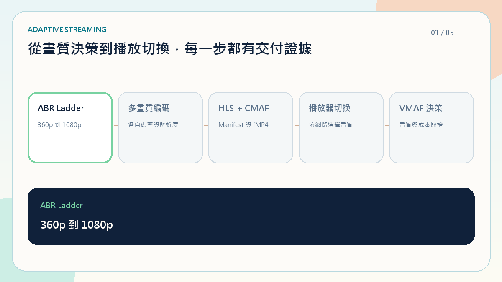

# Media Runtime Lab

[](https://github.com/RemyJerrie1/media-runtime-lab/actions/workflows/verify.yml)

> 可復原的影音處理工作流後台 — Recoverable media processing workflow backend.

可復原是三件具體的事：

- 同一個指令送幾次，都只有一個工作
- worker 掛掉後，另一個 worker 可以接手
- 連線中斷後，可以從斷點接回事件

這三條都有測試，並在 CI 使用真正的 PostgreSQL 驗證。

## Dreamy 預設影片

內建一支八秒療癒系倉鼠短片：六格走路循環呈現手腳交替、身體起伏、風吹毛與書包慣性擺動；角色沿下方步道前進，三段中文字幕固定在上方安全區，並搭配柔和提示音。影片會實際送進後端 FFmpeg，供剪輯、編碼、合成與成品播放流程使用。

<a href="./docs/media/product-demo.mp4"></a>

## 任務生命週期

任務依序經過接受、合成、編碼、封裝與交付；每一步都有狀態、進度與復原證據。

<a href="./docs/media/render-lifecycle.mp4"></a>

## 字幕與合成

包含中文字幕、Sprite Sheet、Canvas 2D 合成，以及 CSS 3D 圖層示範。

<a href="./docs/media/composition-showcase.mp4"></a>

## 任務復原

後端保存 job、event 與 work lease。重複指令會回到同一個 job；lease 過期後可由其他 worker 接手；SSE 依 `Last-Event-ID` 重播事件。

<a href="./docs/media/reliability-recovery.mp4"></a>

完成時，成品紀錄、`ready` 狀態、事件與工作完成會在同一筆交易寫入。

## 介面規格

<a href="./docs/media/api-contract.mp4"></a>

- `POST /v1/media`：上傳來源影片並取得媒體資產識別碼
- `POST /v1/media/demo`：準備內建 Dreamy 示範影片
- `POST /v1/render-jobs`：以媒體資產建立或重播同一個指令
- `GET /v1/render-jobs/:id`：讀取目前狀態
- `SSE /v1/render-jobs/:id/events`：接收與重播進度事件
- `GET /streams/:jobId/master.m3u8`：讀取 HLS Master Playlist，並延伸至各畫質 Playlist 與 CMAF Segments
- `GET /v1/operations`：讀取任務、復原、追蹤與成本證據
- `GET /media/:assetId`：以 HTTP Range Request 預覽來源影片
- `GET /artifacts/:jobId.mp4`：用 HTTP Range Request 傳送轉檔成品

Worker 會以 `ffprobe` 檢測來源、實際執行 FFmpeg，產生 360p／540p／720p／1080p ABR Ladder，再封裝為 HLS + CMAF（Master Playlist、各畫質 Playlist、初始化片段與 fragmented MP4 Segments）。每個 Rendition 都會計算 SHA-256，並在可用 `libvmaf` 的 FFmpeg 環境中，實際比較來源與輸出畫質；若環境未提供 `libvmaf`，API 會明確回傳 `unavailable`，不使用固定示範分數。

<a href="./docs/media/streaming-delivery.mp4"></a>

建立任務時可設定 `deliveryFormat: "hls-cmaf"`、`abrLadder: "standard"` 與 `qualityMetric: "vmaf"`。完成後的任務 JSON 會包含各 Rendition 的解析度、碼率、Playlist URL、VMAF、Checksum，以及 Master Manifest URL、Trace ID 與 Request ID。`evidence` 同步保存 ffprobe 媒體規格、關鍵影格間隔、音畫長度差、成品播放檢查、水印模式及實際 Playlist／CMAF 分段數量。`GET /streams/:jobId/master.m3u8` 提供播放器使用的自適應串流入口。

預設使用專案附帶的 FFmpeg；部署時也可用 `FFMPEG_BINARY` 與 `FFPROBE_BINARY` 指向完整建置。若要求 VMAF，指定的 FFmpeg 必須包含 `libvmaf` filter。

## API 回歸測試

Bruno 測試涵蓋建立工作、重複指令、錯誤輸入、狀態查詢與復原流程。

<a href="./docs/media/bruno-contract-tests.mp4"></a>

## 成本歸因示範

用模擬資料呈現供應商用量、專案歸因與預算門檻；沒有呼叫外部模型。

<a href="./docs/media/ai-cost-governance.mp4"></a>

## 設計系統

共用色彩、間距、字體與狀態元件，並實際用在工作台頁面。

<a href="./docs/media/design-system-showcase.mp4"></a>

## 程式結構

```text
apps/web/                 Next.js 操作介面
apps/api/src/render/
  domain/                 狀態機、規則與 ports
  application/            工作調度與 worker
  interfaces/             HTTP 與 SSE
  infrastructure/         PostgreSQL 與記憶體 adapter
packages/contracts/       前後端共用 Zod contract
bruno/                    API 回歸測試
```

依賴方向：`interfaces → application → domain ← infrastructure`

- [架構選擇](./docs/adr/0001-modular-control-plane.md)
- [持久化與事件重播](./docs/adr/0002-durable-workflow-and-replay.md)
- [維運與失敗模式](./docs/architecture/operations.md)

## 本機執行

面試現場開機後，在專案目錄開啟 PowerShell，只需執行：

```powershell
pnpm demo
```

Windows 也可以直接雙擊專案根目錄的 `START-MEDIA-LAB.cmd`；展示結束後雙擊 `STOP-MEDIA-LAB.cmd`。

也可使用專案 CLI：`./media-lab start`、`./media-lab stop`、`./media-lab restart`、`./media-lab status`。

此指令會建立缺少的 `.env`、安裝首次啟動所需套件、啟動並檢查 PostgreSQL、API 與 Web，確認兩端皆回傳成功後才開啟瀏覽器。啟動紀錄保存在 `.demo-logs`，方便現場直接查看錯誤。若已經有健康的服務正在執行，指令會沿用；若 3000 或 4000 被其他程序占用，會指出衝突，不會再啟動一份服務。

不需要自動開啟瀏覽器時可執行 `pnpm demo -- -NoBrowser`。

展示結束後完整停止 Web、API 與本專案 PostgreSQL：

```powershell
pnpm demo:stop
```

需要清掉前一次由啟動器建立的程序並重新啟動時：

```powershell
pnpm demo:restart
```

完整開發與檢查流程：

```powershell
pnpm install
Copy-Item .env.example .env
docker compose up -d postgres
pnpm verify
pnpm dev
```

`pnpm install` 會透過 `ffmpeg-static` 與 `@ffprobe-installer/ffprobe` 安裝本機執行檔，不需要另外設定系統 PATH。

- Web：`http://localhost:3000`
- API：`http://localhost:4000`
- API 參考頁：`http://localhost:3000/api-reference`
- Bruno：`pnpm bruno`

`pnpm verify` 會檢查格式、架構邊界、合約、型別、測試與正式版本建置。本機沒有設定 `DATABASE_URL` 時，PostgreSQL 整合測試會跳過；CI 會使用真正的 PostgreSQL 執行。
