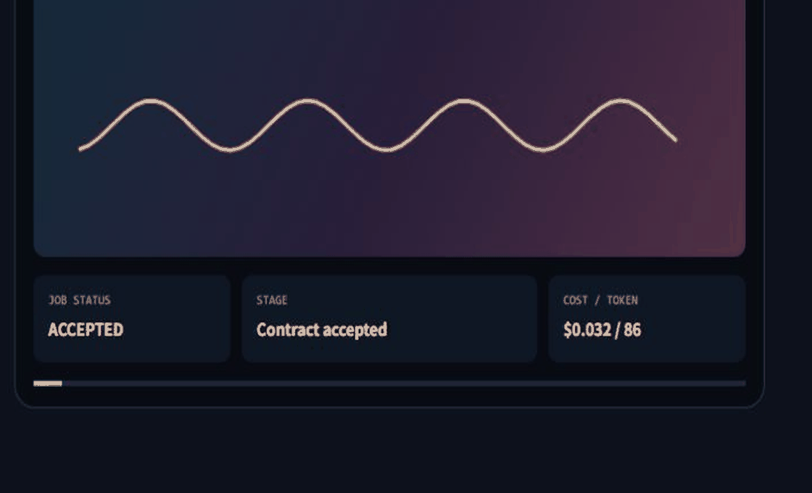
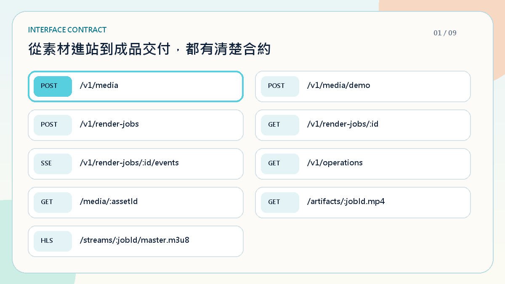

# Media Runtime Lab

> 一個可執行、可驗證、可治理的全端影音任務系統。

- 🎬 **Media Pipeline** — 建立任務 → 非同步處理 → 成品交付
- 🛡️ **Runtime Reliability** — Idempotency · State Machine · SSE Recovery
- 📊 **Operational Evidence** — Artifact · Token Usage · Cost Attribution

## 🎬 影音任務全流程

[](./docs/media/product-demo.mp4)

- 同一個 `Job Identity` 串起 API、SSE Progress 與 Artifact Delivery
- AI Provider 可替換；Canvas／FFmpeg 保留 Deterministic Fallback

## ⚙️ Render Job Lifecycle

[](./docs/media/render-lifecycle.mp4)

- `accepted → composing → encoding → packaging → ready`
- Retry-safe · Recoverable · Observable

## 🔌 API Contract

[](./docs/media/api-contract.mp4)

- `POST /v1/render-jobs` — 建立具 Idempotency Key 的任務
- `GET /v1/render-jobs/:id` — 讀取 Authoritative State
- `SSE /v1/render-jobs/:id/events` — 接收進度並支援斷線恢復

## ✅ Bruno Regression

[](./docs/media/bruno-contract-tests.mp4)

- 4 Requests · 5 Assertions
- 驗證 Idempotency、Boundary Rejection 與 State Recovery

## 🧭 Codex Engineering Governance

- **Project Config** — [`.codex/config.toml`](./.codex/config.toml) + [Lifecycle Hooks](./.codex/hooks.json)
- **Codex Hooks** — [PreToolUse Policy](./.codex/hooks/pre-tool-governance.mjs) + [Stop Governance Gate](./.codex/hooks/governance-gate.mjs)
- **Codex Skills** — [Development](./.agents/skills/development/SKILL.md) · [Frontend](./.agents/skills/frontend/SKILL.md) · [Backend](./.agents/skills/backend/SKILL.md) · [E2E](./.agents/skills/test-e2e/SKILL.md)
- **Engineering Policy** — [`AGENTS.md`](./AGENTS.md) + [Safe Media Change](./.agents/skills/safe-media-change/SKILL.md)
- **Automated Gates** — Dependency Boundary · Contract Drift · Typecheck · Tests · Production Build
- **Decision Record** — [ADR 0001](./docs/adr/0001-modular-control-plane.md)

<details>
<summary><strong>🧪 Local Verification</strong></summary>

```bash
pnpm install
pnpm verify
pnpm dev
```

- Web — `http://localhost:3000`
- API — `http://localhost:4000`
- API Reference — `http://localhost:3000/api-reference`
- Bruno — `pnpm bruno`

</details>
