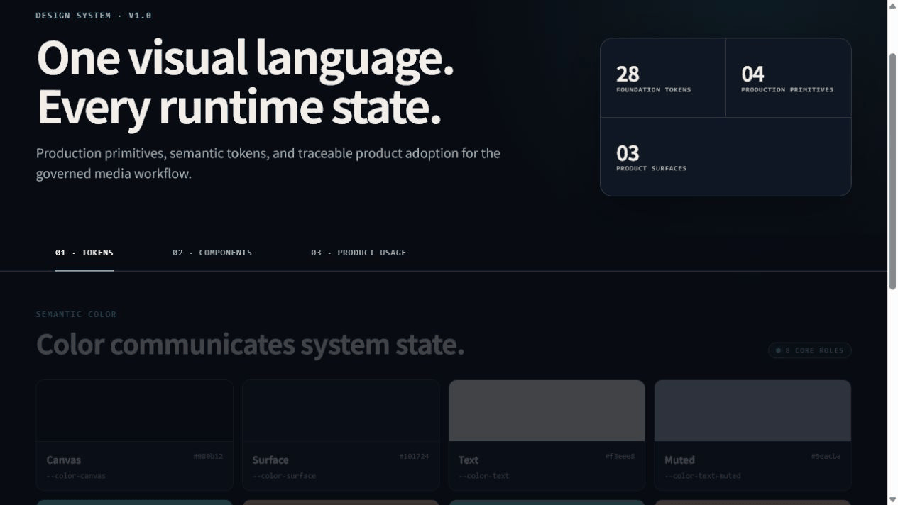
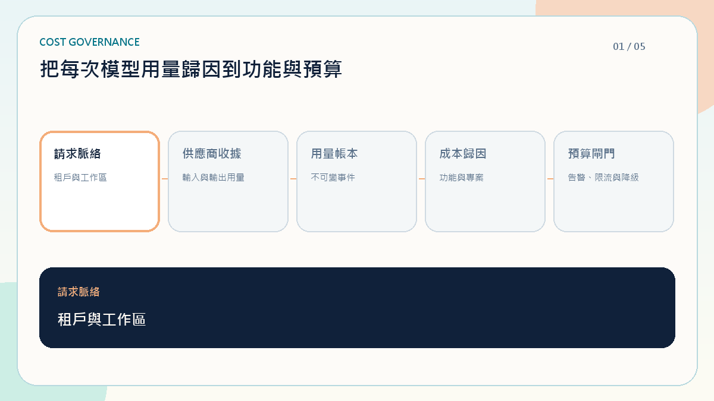
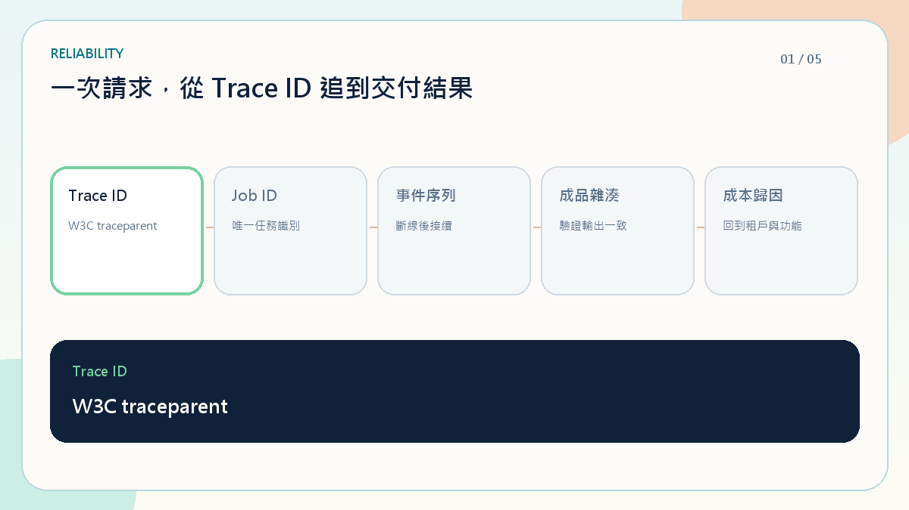

# 媒體運行實驗室（Media Runtime Lab）

[](https://github.com/RemyJerrie1/media-runtime-lab/actions/workflows/verify.yml)

可在本機操作的影音工程作品：從剪輯、FFmpeg 編碼與媒體合成，到可復原工作流及人工智慧成本治理。

## The high-risk problem

- Duplicate commands waste render and AI cost
- Restarts and SSE disconnects can lose workflow state
- Untraced artifacts cannot be governed

## Runtime guarantees

- **One command, one job** — database-backed idempotency
- **Restart-safe** — persisted jobs, events, leases, and SSE replay
- **Atomic completion** — artifact and `ready` state commit together
- **Governed execution** — tenant controls, quotas, and end-to-end trace

## 🎬 互動式影音工作流

<a href="./docs/media/product-demo.mp4"></a>

- **Frontend** — Next.js App Router · SSE Progress · Canvas Timeline
- **Backend** — NestJS · Idempotency · State Machine · Artifact Registry
- **Media** — CJK Subtitle · Sprite Sheet · 2D/3D Composition · FFmpeg-ready Adapter
- **互動工作台** — 剪輯 · CRF／碼率 · 編碼預設 · FPS · GOP · CFR／VFR · 音畫同步 · 字幕 · 水印 · 廣告插入 · Faststart
- **Operations** — Retry & Recovery · Token Usage · Cost Attribution

## 🎨 Design System & Product Adoption

<a href="./docs/media/design-system-showcase.mp4"></a>

- **Semantic Tokens** — Color · Spacing · Type · Radius
- **Production Primitives** — Button · Metric Card · Status Badge · Progress Bar
- **Interaction States** — Default · Hover · Loading · Disabled · Success · Warning · Failure
- **Traceable Adoption** — Every primitive maps back to Render, Composition, or Governance surfaces

## 🎞️ Composition Timeline

<a href="./docs/media/render-lifecycle.mp4"></a>

- Scene Clips · CJK Subtitle Cues · Audio Envelope
- 18-second Timeline · 30 fps Frame Identity · Render Playhead

## ✨ Subtitle · Sprite · 2D/3D Composition

<a href="./docs/media/composition-showcase.mp4"></a>

- **CJK Subtitle** — Cue changes aligned with the media clock
- **Sprite Sheet** — Traceable frame index and playback progress
- **Canvas 2D** — Deterministic composition fallback
- **CSS 3D** — Layered motion with an explicit WebGL/Three.js adapter boundary

## 💰 AI Token Usage & Cost Governance

<a href="./docs/media/ai-cost-governance.mp4"></a>

- **Usage Receipt** — Provider · Model · Prompt/Completion Token
- **Attribution** — Tenant · Workspace · Project · Feature
- **Usage Ledger** — Append-only events as the source of truth for cost and quota
- **Budget Gate** — Alert · Throttle · Model Fallback
- **Execution Note** — Provider receipts are simulated; no external model or API key is used
- **FFmpeg Note** — The local demo validates and persists executable ffprobe/FFmpeg argument plans; its artifact remains simulated until a real uploaded source and isolated FFmpeg worker are connected

## 🛡️ Reliability & Recovery

<a href="./docs/media/reliability-recovery.mp4"></a>

- Database-enforced idempotency returns one Job Identity across concurrent API instances
- Persisted event sequences replay after `Last-Event-ID`, including after job completion
- Expired outbox leases let another worker resume after process interruption
- Artifact checksum, ready state, event, and work completion commit atomically

## 📊 Evidence & Production Boundary

- **Verified** — duplicate prevention, contract drift gate, trace fields
- **Measured** — 100 concurrent commands → 1 job; replay → no missing sequences; expired lease → attempt 2
- **Targets** — 99.9% render success; ≤ 2s reconnect recovery
- **Simulated** — FFmpeg/provider work, local credentials, in-process metrics
- **Next** — object storage, external identity, provider receipts, OpenTelemetry alerts

## 🔌 API Contract

<a href="./docs/media/api-contract.mp4"></a>

- `POST /v1/render-jobs` — Idempotent Command
- `GET /v1/render-jobs/:id` — Authoritative State
- `SSE /v1/render-jobs/:id/events` — Progress and Recovery

## 🧪 Bruno Regression

<a href="./docs/media/bruno-contract-tests.mp4"></a>

- 5 Requests · 7 Tests
- Idempotency · Boundary Rejection · State Recovery

## 🧱 Architecture & Ownership

```text
apps/
├─ web/app/
│  ├─ design-system/             # Design Tokens · UI Primitives
│  ├─ config/                    # Environment · Media Runtime Constants
│  ├─ shared/
│  │  ├─ api/                    # Typed API Adapters
│  │  ├─ constants/              # Navigation · Shared Policies
│  │  ├─ hooks/                  # SSE Lifecycle · Recovery
│  │  └─ ui/                     # Shared Presentation
│  └─ features/
│     ├─ render-lab/             # Job Lifecycle · Media Timeline
│     ├─ composition-showcase/   # CJK Cue · Sprite · Canvas 2D · CSS 3D
│     └─ cost-governance/        # Usage Receipt · Attribution · Budget Gate
└─ api/src/render/
   ├─ domain/                    # State Machine · Invariants · Ports
   ├─ application/               # Use Cases · Job Orchestration
   ├─ interfaces/                # HTTP · SSE · Contract Validation
   └─ infrastructure/            # PostgreSQL · Outbox · Worker Adapters

packages/contracts/              # Shared Zod Contract · No DTO Drift
bruno/                           # Executable HTTP Regression
.agents/skills/                  # Development · Frontend · Backend · E2E
.codex/                          # Hooks · Governance Gate · Project Config
.husky/pre-commit                # Governance · Typecheck · Tests
scripts/                         # Architecture Fitness Functions
```

- **Frontend Three Layers** — Route (RSC) → Feature (Client Island) → Shared/Design System
- **Backend Boundary** — Interface → Application → Domain ← Infrastructure
- **Design System** — Centralized tokens and primitive interaction rules
- **State Ownership** — `useRenderJob` owns server state; media canvases own transient render state
- **App Router** — `layout`, `page`, `loading`, `error`, and `not-found` follow official file conventions

## ⚙️ Codex Engineering Governance

- **Project Config** — [`.codex/config.toml`](./.codex/config.toml) · [Lifecycle Hooks](./.codex/hooks.json)
- **Codex Hooks** — [PreTool Policy](./.codex/hooks/pre-tool-governance.mjs) · [Stop Gate](./.codex/hooks/governance-gate.mjs)
- **Codex Skills** — [Development](./.agents/skills/development/SKILL.md) · [Frontend](./.agents/skills/frontend/SKILL.md) · [Backend](./.agents/skills/backend/SKILL.md) · [E2E](./.agents/skills/test-e2e/SKILL.md)
- **Architecture Decisions** — [ADR 0001](./docs/adr/0001-modular-control-plane.md) · [ADR 0002](./docs/adr/0002-durable-workflow-and-replay.md)
- **Operations Model** — [SLOs, failure modes, and trace evidence](./docs/architecture/operations.md)

## ✅ Verification

- Contract Tests · Domain Tests · Application Tests
- Timeline Mapping · Subtitle Cue · Sprite Frame · Playhead Boundary · Frame Identity
- AI Usage Aggregation · Cost Attribution · Budget Threshold
- Bruno HTTP Regression · Typecheck · Production Build
- Husky Pre-commit · Architecture Fitness Functions

<details>
<summary><strong>Local Verification</strong></summary>

```bash
pnpm install
Copy-Item .env.example .env
docker compose up -d postgres
pnpm verify
pnpm dev
```

- Web — `http://localhost:3000`
- API — `http://localhost:4000`
- API Reference — `http://localhost:3000/api-reference`
- Bruno — `pnpm bruno`

</details>
