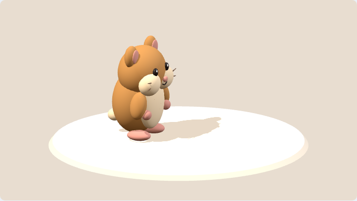
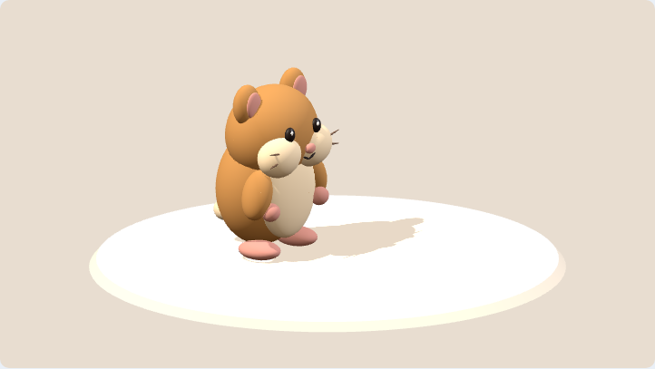
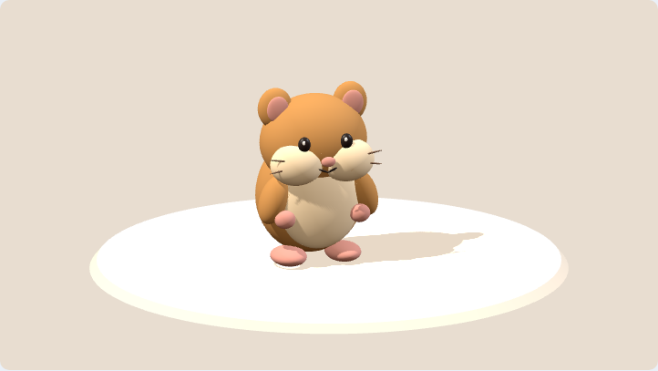
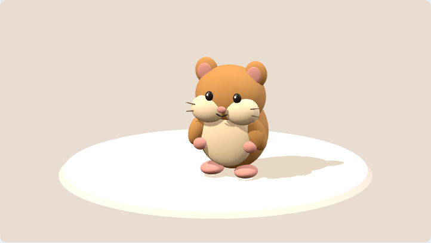
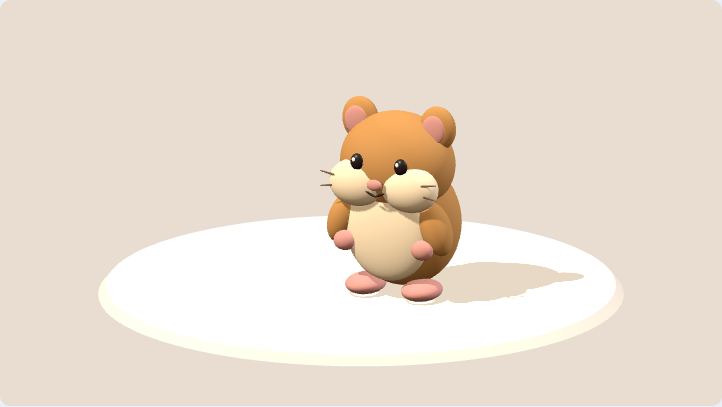
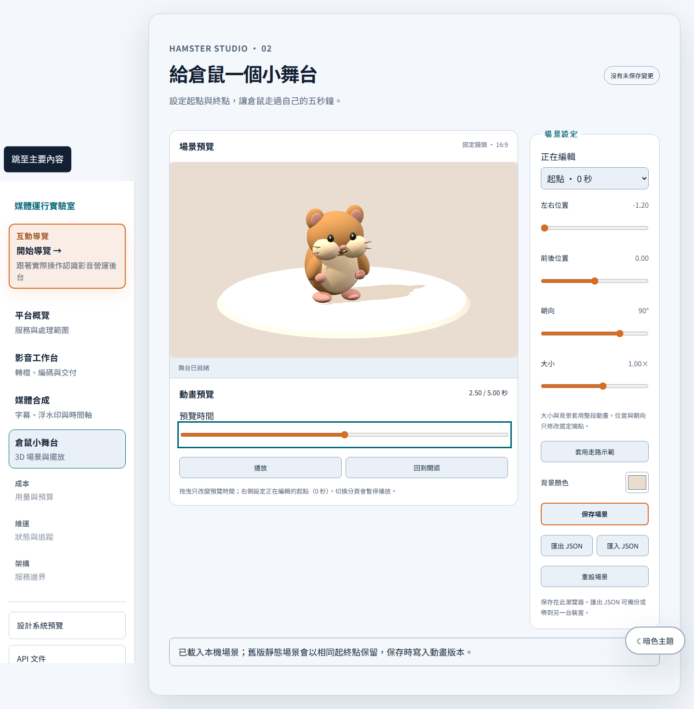

# 3D 倉鼠第 2 輪：可重現的五秒動畫

驗收來源：[issue #4](https://github.com/RemyJerrie1/media-runtime-lab/issues/4)。

## 行為與資料

`/hamster` 保留原有場景設定、保存、JSON 與故障恢復，新增起點／終點 X/Z 與朝向、播放／暫停／重播／回到開頭，以及 0–5 秒時間滑桿。選擇或編輯端點會暫停並跳到該端點；拖曳只改變預覽，不修改場景或 dirty 狀態。大小與背景作用於整段。走路示範在確認後只替換起終點。

共用 `hamsterSceneSchema` 現為 v2；起點沿用 `transform`，終點位於 `animation.end`，`animation.durationSeconds` 固定 5。`hamsterSceneDocumentSchema` 接受嚴格的 v1／v2 文件，v1 轉換為起終點相同的 v2，完整保留背景、位置、朝向與大小。未知版本、缺失動畫欄位或越界資料拒絕載入。

沿用既有 storage key `media-runtime-hamster-scene-v1` 以讀取第一輪資料；key 是儲存槽名稱，文件內 `version` 才代表格式。載入升級只在記憶體進行，使用者明確保存才覆寫，匯出為 v2。回退到第一輪程式時 v2 會被拒絕讀取，不做有損降版。

## 確定性與播放

`evaluateScene(document, timeSeconds)` 是唯一姿勢計算入口，純函式回傳整體位移／旋轉／縮放、身體起伏、雙腳與手臂變換。位置與朝向共用 smoothstep 補間，頭尾速度為零；朝向採最短轉角，恰好 180° 時固定選負方向。時間限制在 0–5 秒，非有限值回到 0。

步態相位以已移動距離除以隨身材調整的步長計算，頭尾以包絡收斂至站姿。位移為零時腳步與身體起伏為零，僅轉身也不原地滑步。這是幾何角色的簡化程序動畫，沒有物理或骨架求解器。固定鏡頭與燈光沿用第一輪。

播放以 `performance.now()` 的時間錨點計算絕對時間，RAF 僅觸發取樣，不累積位移／旋轉。到 5 秒停止，重播从 0 開始；暫停保留當下時間。分頁隱藏時暫停，返回需明確播放，不偷偷追趕背景經過時間。卸載取消 RAF、移除 visibility listener，沿用 renderer 的完整資源清理。畫布尺寸未變時不重設 drawing buffer。

## 驗證

本機 Windows、Node 22.23.2、pnpm 11.16.0、Playwright 1.63.0 Chromium。專用 PostgreSQL instance 在 127.0.0.1:55440；測試以隔離 schema 執行，FFmpeg 執行實際編碼／解碼檢查。

- `pnpm verify`：治理 21/21；contracts 5、web 69、API 33，共 **107/107**，包含 PostgreSQL 6、FFmpeg 4，無略過；型別與 production build 通過。
- `pnpm test:e2e`：**24/24**，保留第一輪 6 項、既有工作台 14 項，新增動畫 4 項。Bruno 6 requests／8 tests 亦透過真實 API 通過。
- 純函式測試：0、1、2.5、4、5 秒，反向／重複拖曳、24/30/60/144 fps 取樣、最短角度、越界時間、腳掌非負高度與連續性、靜止／原地轉身、v1 升級。
- 真實 WebGL 測試：上述五個時間點得到五個不同畫面；反向拖曳及保存重載後同時間的 PNG 完全一致。比較限於同一 Chromium 執行環境，不承諾跨 GPU 的逐像素一致。
- 播放、暫停、繼續、到尾停止、重播、端點編輯互不污染；模擬 `document.hidden` 與 `visibilitychange` 驗證背景暫停。攔截 RAF 計數確認卸載無殘留回呼，新工作區從暫停的 0 秒開始。
- 桌面 1440px、窄螢幕 390px 與代表姿勢截圖已人工檢視；既有明暗主題與故障恢復測試仍通過。

原始紀錄：忽略的 `.runtime/hamster-animation-verify.log`、`.runtime/hamster-animation-e2e.log` 與 `.runtime/playwright-results/`。CI 沿用既有工作流程收集全部新測試，最終 SHA 與綠燈連結回填 issue #4 後才結案。

本輪不增加字幕、聲音、任意關鍵幀或輸出按鈕；字幕屬下一輪 #5。

## 已檢視畫面

| 0 秒 | 1 秒 | 2.5 秒 | 4 秒 | 5 秒 |
| --- | --- | --- | --- | --- |
|  |  |  |  |  |

[手機操作截圖](hamster-animation/mobile.png)
