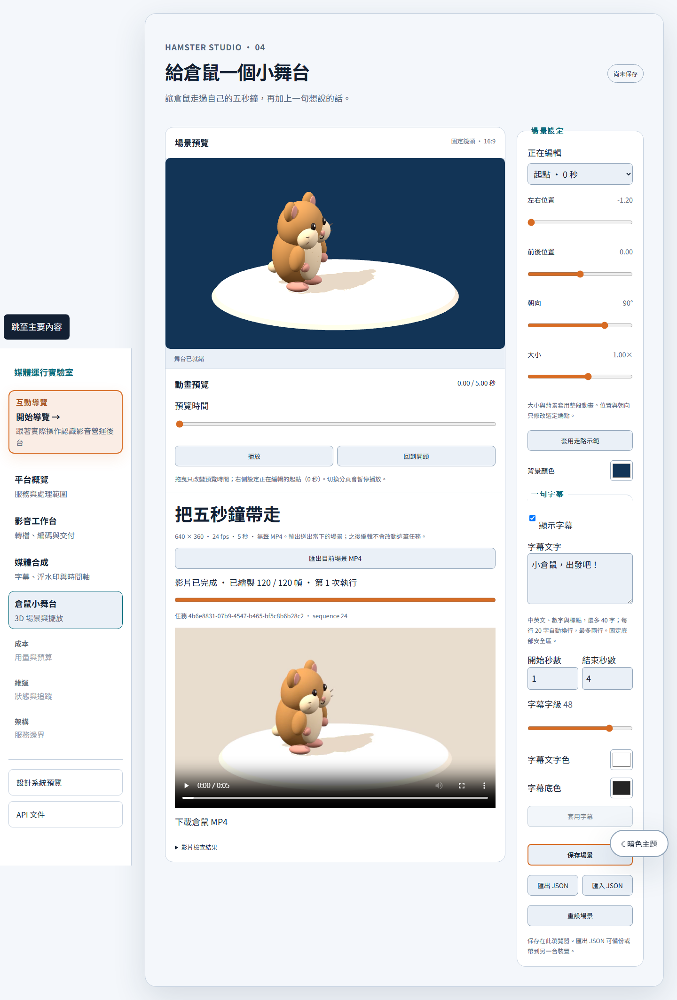

# Hamster silent MP4 export — 2026-09-22

Scope: [issue #6](https://github.com/RemyJerrie1/media-runtime-lab/issues/6). Architecture: [ADR 0003](../adr/0003-deterministic-scene-export.md).

The editor and offline renderer share scene evaluation, Three.js drawing and caption composition. Submission freezes the scene with a UUID idempotency key. PostgreSQL leases fence worker attempts; only a verified, committed receipt makes an output ready. Reloading or retrying an uncertain response resumes the original operation. Changed content with the same key returns 409.

## Verification

- `pnpm verify`: passed, 22 governance tests and 126 application tests (9 contracts, 71 web, 46 API), including 13 real PostgreSQL tests. Type checks and production builds passed; no database tests skipped.
- `pnpm test:e2e`: 30 passed, including save/reload/export/play/download, snapshot isolation, ambiguous submission recovery, conflicting replay and cancellation.
- Bruno against the running API: 9 requests and 11 assertions passed.
- Real rendering tests cover 120-frame output, unavailable font/WebGL, cancellation, process termination and overall timeout cleanup. Database tests cover stale leases, retry exhaustion, queue limits, stale artifact cleanup and a lost acknowledgement after publication committed.
- Full local logs: `.runtime/scene-export-verify.log` and `.runtime/scene-export-e2e.log`. CI uploads browser evidence, including the output, receipt and decoded frames.

## Actual output

[Download/play the measured MP4](hamster-export/hamster.mp4) · [receipt and comparisons](hamster-export/receipt.json)

Windows, Node 22.23.2, Playwright 1.63.0 Chromium with SwiftShader, bundled Noto Sans TC and FFmpeg. This is a reproducible functional fixture, not a rendering speed benchmark.

| Measurement | Result |
| --- | --- |
| Video | H.264, 640 × 360, 24 fps |
| Frames / duration | 120 / 5 seconds |
| Audio streams | 0 |
| Size | 137,495 bytes |
| SHA-256 | `5c4e8262c66065eb14db6ef0422f072f3e21a84809009b51e340f3ac641992b9` |
| Full FFmpeg decode | Passed |
| Preview/output comparison | Frames 0, 23, 24, 60, 95, 96; mean absolute channel error 1.56–1.62 out of 255 |

Comparisons include caption boundaries and moving poses; thresholds are below 8 overall and below 10 in the bottom caption region. GPU/codec output is not promised to be bit-identical across machines. Desktop and mobile screenshots were inspected for readable captions, controls and overflow.

[Mobile view](hamster-export/export-mobile.png) · [decoded frame at 2.5 seconds](hamster-export/decoded-60.png)

## Limits

This completes the five-second silent MVP. Audio remains a separate round. Export requires PostgreSQL, installed Chromium, FFmpeg and writable local artifact storage. The output is fixed at 640 × 360 / 24 fps. Abrupt operating-system termination can leave unpublished temporary/orphan files; normal failure, cancellation and timeout paths clean up their attempt resources. A publication whose database acknowledgement is uncertain retains its artifact until its committed receipt can be checked, avoiding deletion of a published video. No public deployment was performed.
