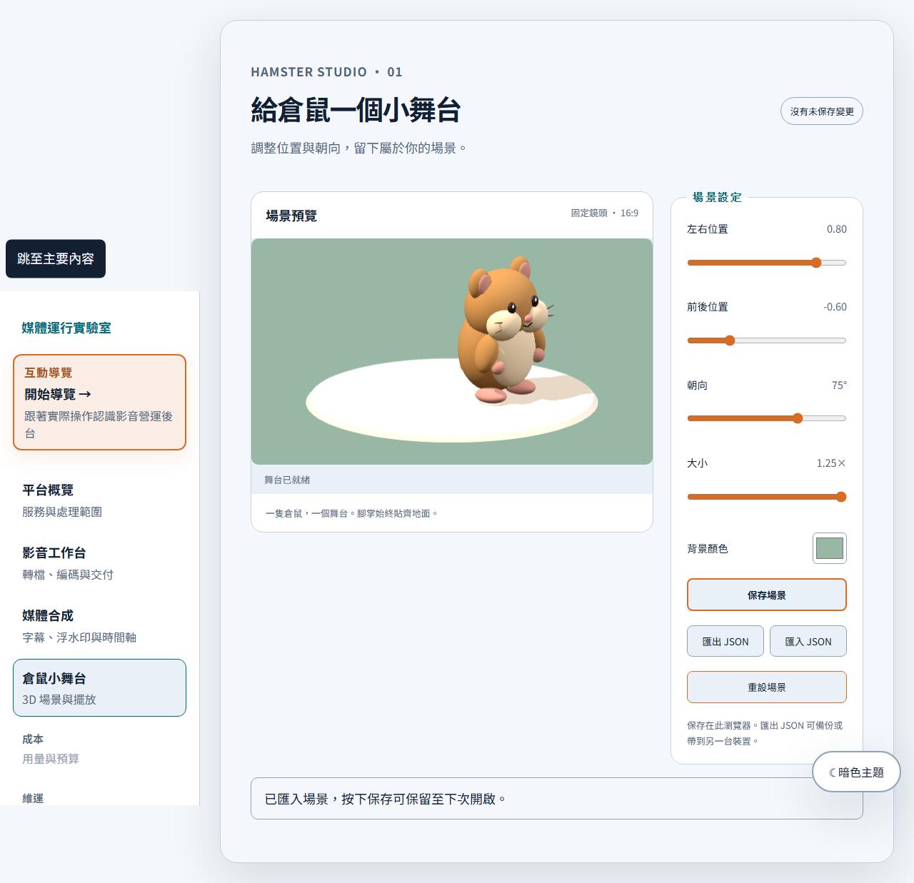
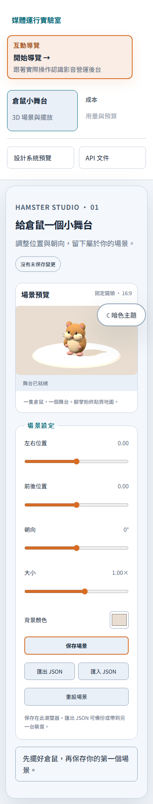
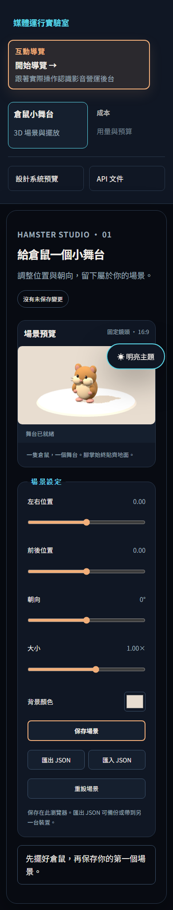

# 3D 倉鼠第 1 輪：可保存的小舞台

範圍與驗收來源：[issue #3](https://github.com/RemyJerrie1/media-runtime-lab/issues/3)。

## 交付行為

`/hamster` 已接入既有側邊工作區與概覽。程序化 3D 倉鼠可調整 X/Z、朝向、等比大小及背景色；固定 16:9 鏡頭、舞台與燈光。模型使用具名階層節點，沒有新增動畫、字幕或影片輸出入口。

場景為 `packages/contracts` 的 `hamsterSceneSchema` v1：固定 subject、嚴格欄位、有限數值、X/Z ±1.2、朝向 ±180°、大小 0.65–1.25、六碼色彩。JSON 匯入上限 16 KiB；本機 key 為 `media-runtime-hamster-scene-v1`。未知版本、損毀檔案與越界資料不會覆寫目前場景。匯入只替換畫面，按保存才覆寫本機資料；匯出不會清除未保存狀態。

保存、重設與匯入有明確確認；工作區切換、瀏覽器返回與頁面卸載保護未保存修改。非同步匯入以 revision 與卸載狀態避免覆寫更新後的場景。

## 渲染與捕捉可行性

Three.js 0.186.0 的真實 WebGLRenderer，程序化球體與圓柱，不使用角色貼圖或 Canvas mock。Renderer 以動態 import 載入，僅在設定或尺寸變更時重畫；不啟動持續 RAF。固定相機、SRGB、陰影；DPR 上限 2。模型腳底 local Y=0、舞台頂端 Y=0.06，縮放不改變接地高度。

保留 drawing buffer，Chromium `toDataURL('image/png')` 可捕捉畫面；測試確認各變換改變捕捉結果，並實際觸發 `WEBGL_lose_context` 後重建預覽。卸載斷開 ResizeObserver、移除事件，dispose geometry/material/shadow/renderer 並釋放 WebGL context；測試保留舊 context 引用確認其已 lost。

這只證明固定畫面可捕捉。逐幀動畫、字型與 MP4 合成仍屬後續輪次；不承諾不同 GPU 的逐像素一致性。

## 執行證據

本機 Windows、Node 22.23.2、pnpm 11.16.0、Playwright 1.63.0，使用其 Chromium。PostgreSQL 專用測試 instance：127.0.0.1:55440，測試建立隔離 schema；原有 FFmpeg 實測正常執行。

- `pnpm verify`：治理 21/21；contracts 3、web 64、API 33，共 100/100 應用測試，包含 PostgreSQL 6、FFmpeg 4；型別與 production build 通過，無略過。
- 完整 `pnpm test:e2e`：19/19 通過（原有 14 + 倉鼠 5）。再補版本覆寫／返回保護與實際主題切換後，`pnpm exec playwright test e2e/hamster-stage.spec.ts`：6/6 通過。CI 自動收集最終全部 20 項測試。
- Bruno：6/6 requests、8/8 tests，含同 key 回原任務與衝突 409；亦包含在既有 E2E。
- 桌面、390px 窄螢幕明暗主題、四個位置極值搭配 1.25× 大小截圖已人工檢視：完整倉鼠可見、腳掌接地、無水平頁面溢出。
- 故障測試：非法／過大／新版本 JSON、拒絕覆寫、storage 讀寫失敗、WebGL 不可用、context lost 重試、離開後資源釋放。

測試發現既有 ThemeToggle／InterviewTour 在 storage 被瀏覽器禁止時會令整頁崩潰；已讓這些可選偏好退回記憶體狀態。場景文件仍明確顯示儲存錯誤，不將失敗當作保存成功。

原始紀錄在忽略的 `.runtime/hamster-verify.log`、`.runtime/hamster-e2e.log`、`.runtime/hamster-focused-e2e.log`、`.runtime/hamster-bruno.log`。CI 會上傳 `browser-test-evidence`，內含 Playwright 報告及畫面。最終 commit 的 CI 連結記錄於 issue #3，CI 成功後才關閉 issue。

## 已檢視畫面

| 手機明亮主題 | 手機暗色主題 |
| --- | --- |
|  |  |
