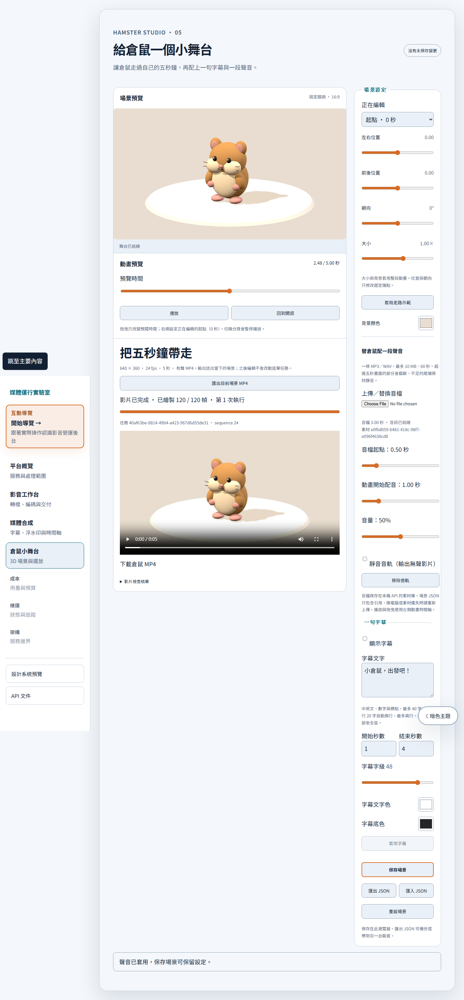

# Hamster single audio track — 2026-09-23

Scope: [issue #7](https://github.com/RemyJerrie1/media-runtime-lab/issues/7). Decision and limits: [ADR 0004](../adr/0004-single-audio-track.md).

The editor now accepts one MP3/WAV track, source trim, timeline start, gain, mute and removal. Audio persists in the local API asset store; the scene stores its immutable identity and settings. Save/reload restores playback. Missing audio is visible and replaceable without losing the scene. Scene v4 coexists with original v3 commands/receipts and the silent export path.

## Executed verification

- `pnpm verify`: 22 governance tests and 133 application tests (12 contracts, 71 web, 50 API); type checks and production builds passed. Includes 14 real PostgreSQL tests, none skipped.
- `pnpm test:e2e`: 33 passed, including upload/save/reload, timeline seek/pause/replay, mute/remove, denied playback permission and explicit retry, audible playback/download, missing/replacement assets, metadata forgery rejection and the existing silent/legacy/recovery regression suite.
- Bruno: 13 requests and 15 tests passed, no failures or skips. Includes actual WAV upload, persisted metadata lookup and missing-audio errors.
- Real FFmpeg tests validate MP3/WAV decoding, format/size/duration limits, immutable metadata/content and tenant ownership. Decoded PCM verifies source trimming, delayed onset, half gain, silent tail and clipping at five seconds; muted export remains video-only.
- PostgreSQL tests prove audio identity/settings participate in idempotency conflicts, preserve the submitted snapshot and reject a ready receipt with the wrong audio-stream count. Existing lease/fencing/recovery checks remain green.

Raw local logs: `.runtime/audio-verify.log`, `.runtime/audio-focused.log`, `.runtime/audio-e2e.log`. Git pre-commit remains enabled and records its full gate in `.runtime/audio-commit.log`. These results do not claim automatic Codex hook dispatch for this parent-directory task.

## Measured output

[Actual audible MP4](hamster-audio/hamster-audio.mp4) · [receipt and probe](hamster-audio/audio-receipt.json)

The fixture is a generated 440 Hz tone, not a user recording. The UI sets source trim to 0.5 seconds, timeline start to 1 second and gain to 50%. Windows, Node 22.23.2, Playwright 1.63.0 Chromium/SwiftShader, local FFmpeg; this is a correctness fixture, not a performance benchmark.

| Measurement | Result |
| --- | --- |
| Video | H.264, 640 × 360, 24 fps, 120 frames |
| Audio | AAC, stereo, 48 kHz |
| Container duration | 5.000 seconds |
| Decoded onset | 1.0000208 seconds (target 1 second; tolerance one video frame) |
| RMS before / active / tail | 0 / 0.0441698 / 0 |
| Size | 78,954 bytes |
| SHA-256 | `58ab988363a757c943dc2c61314fff4fdca37a3230e7ebd41de851874ceedba5` |
| Full decode and browser playback | Passed |

The first integration run caught AAC output losing the intended initial delay after source trimming. The fix rebases timestamps after the final padded/cropped sample sequence. The decoded-onset test now guards this behavior rather than trusting filter arguments.

[Mobile screenshot](hamster-audio/audio-mobile.png). Both layouts were inspected; the 390-pixel viewport has no horizontal overflow.

## Operational limits

Audio is stored by the local API, not embedded in scene JSON. Copying JSON to another machine requires the corresponding asset store or a replacement upload. Uploads are limited to 10 MiB and 60 seconds; one track, five-second output, no AI voice generation, recording, multi-track editor or public deployment. Replaced assets remain immutable for previous jobs; automatic garbage collection is deferred. Browser synchronization uses timeline correction, not a sample-accurate DAW clock. Test-generated source/output assets are retained in ignored `.runtime/`; database tests clean their isolated schemas.
